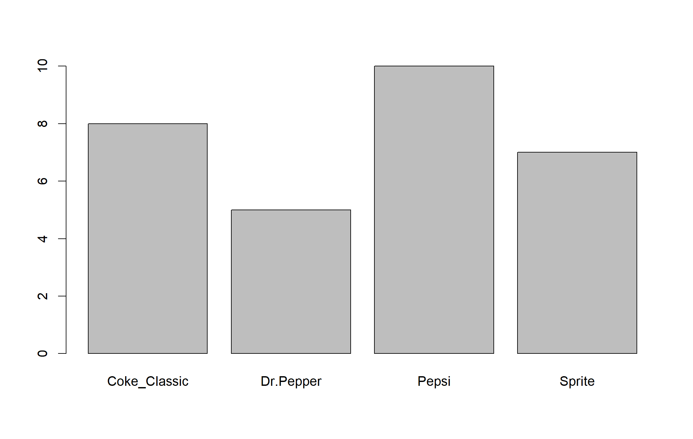
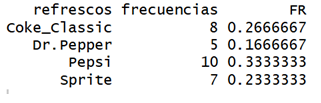
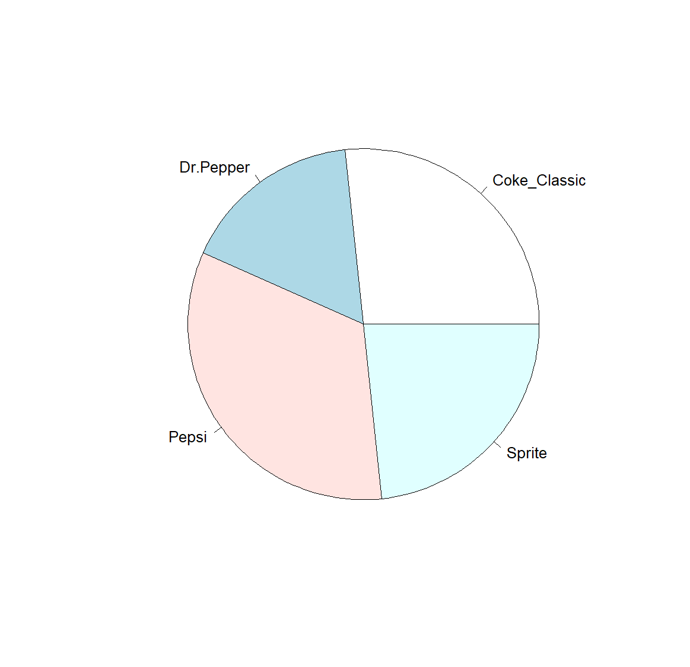
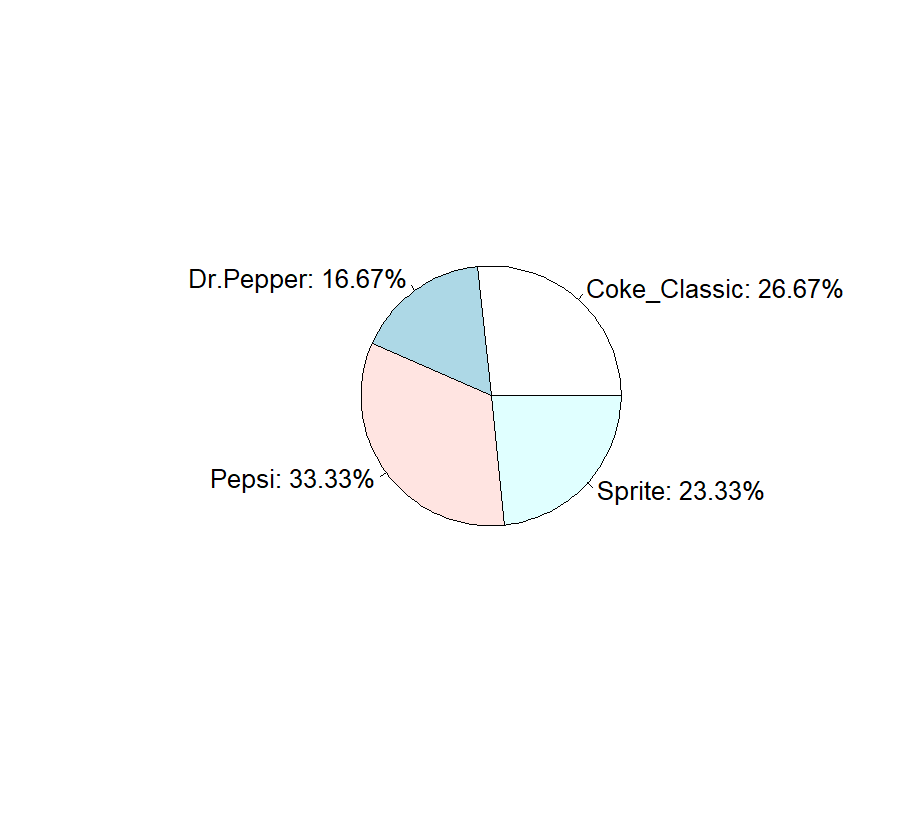
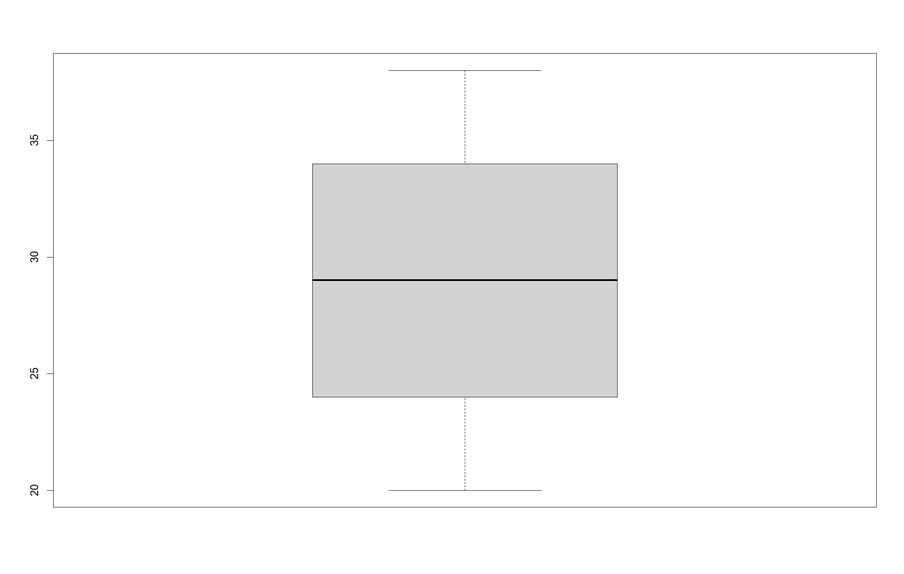

# CURSO DE ESTADÍSTICA

## Introducción

En este repositorio encontraremos ejercicios y ejemplos que se 
realizarán por Rstudio. Para instalar de manera adecuada estas herramientas,
seguiremos las siguientes ligas en ese orden:

**Descargar e instalar paquetería R:**

https://cran.itam.mx/

**Descargar e instalar paquetería LaTeX**

https://miktex.org/download

**Descargar e instalar Rstudio**

https://posit.co/downloads

Si seguimos estos pasos, obtenemos los requisitos mínimos para visualizar y ejecutar
las herramientas matemáticas que utilizaremos. 

Cabe mencionar que si utilizan GitHub, pueden vincular el Rstudio con Git para subir
sus proyectos y tareas. Realizar esto queda fuera de este curso, por lo que invitamos 
a los lectores interesados investigar más a fondo sobre esto.

## Estadística descriptiva

### Conceptos básicos

Empecemos con los conceptos básicos que utilizaremos durante este curso.

El conjunto completo de datos que queremos analizar recibe el nombre de **población**.
Por lo general, la población tiende a ser muy grande para analizarla completa, 
en particular por falta tiempo y/o presupuesto. 
En este caso, analizaremos un subconjunto significativo de la población, el cual se llamará
**muestra**.

Un **censo** es un instrumento que obtiene información de toda la problación.

Una **encuesta** es un instrumento que obtiene información de la muestra.

Un **parámetro** es una medición realizada en una población.

Un **estadístico** es una medición realizada en una muestra.

En esta sección nos concentramos en trabajar con estos últimos objetos. 

Cabe señalar que los estadísticos no son objetos desconocidos. En cursos y/o situaciónes anteriores
posiblemente realizarón el cálculo de los estadísticos más comunes, por ejemplo una proporción o probabilidad, promedio, varianza y desviación estándar.

Retomaremos la definición de estos estadísticos más adelante.

Antes de iniciar con los cálculos es importante reconocer los tipos de datos que trabajaremos.

Existen dos formas de clasificar a los datos. 

- Por su tipo.
- Por su nivel de medición.

### Clasificación por el tipo de datos

En esta clasificación tenemos dos grupos:

- **Datos categóricos, cualitativos o de atributo**
- **Datos numéricos o cuantitativos**

Los datos cualitativos son nombres o etiquetas que no representan un conteo o medición.

Los datos cuantitativos son números que representan conteos o mediciones.

### Ejemplos

Para datos cualitativos:

 - Partidos políticos de un país.
 - Color de pelo.
 - Marca de una calculadora.
 - Los números de una tarjeta de crédito.
 
Para datos cuantitativos:
 
 - Edades de personas
 - Número de autos en una ciudad.
 - Huevos que pone una gallina.
 - Litros de refresco que consume una ciudad.
 - Ventas diarias de una empresa.
 - Arena en una parque.

### Datos cuantitativos

Los datos cuantitativos tienen su propia clasificación:

- **Discretos:** datos que se pueden contar. Utilizan números naturales.
- **Continuos:** datos que no se pueden contar. Utilizan rangos de los números reales.

Esta nueva clasificación separa a los ejemplos anteriores de la siguiente manera:

Datos discretos:

 - Edades de personas
 - Número de autos en una ciudad.
 - Huevos que pone una gallina.
 
Datos continuos: 

 - Litros de refresco que consume una ciudad.
 - Ventas diarias de una empresa.
 - Arena en una parque.

Para finalizar esta parte, dejamos el siguiente ejercicio

*Determina el tipo de dato que representa la siguiente imagen*


### Clasificación por el nivel de medición

En esta clasificación, las características de los datos aumentan conforme vamos 
definiendo los niveles. 

1. **Nominal:** Los datos representan nombres y etiquetas, pero 
no tienen un orden.

2. **Ordinal:** Los datos representan etiquetan con orden, pero la resta de datos carece de sentido.

3. **Intervalo:** Los datos tienen orden y la resta tiene significado, pero no tienen valor inicial. 
Esto es, el cero no representa la falta del atributo.

4. **Razón:** Los datos tienen orden, la resta tiene significado y el cero si represetan ausencia del atributo.

Algunos ejemplos quedan clasificados como sigue:

- **Nominal**

  - Color de ojos.
  
  - Lugar de nacimiento.
  
- **Ordinal**

  - Nivel escolar (primari, secundaria, preparatoria)
  - Intensidad de color (leve, normal,fuerte)
  - Tallas de ropa (chica, mediana, grande)
  
- **Intervalo**

  - Temperatura de una ciudad.
  - Tiempo de elaboración de un proyecto.
  - Calificaciones exámenes.
 
- **Razón**

  - Velocidad de un auto.
  - Altura de un edificio.
  - Ventas de una empresa.
  
Finalizamos esta sección con un ejercicio

*Realiza un mapa conceptual sobre los tipos de datos y sus clasificaciones*

*Agrega ejemplos de cada uno de los tipos de datos que no aparezcan en estas notas.*

### Datos cualitativos

Las etiquetas o datos cualitativos son datos que se necesitan contar para tener información medible. 
Por lo que, para analizar este tipo de datos, primero aprenderemos a contar. 

Consideremos la siguiente base de datos de refrescos de preferencia.

```r
refrescos = c("Coke_Classic", "Pepsi", "Sprite", "Dr.Pepper")
set.seed(1548)
datos = sample(refrescos, 30, replace = T)
```

Algunas preguntas que nos pueden hacer sobre esta base de datos son

*¿Cuál es el refresco que más consumen?*

*¿Cuál es el refresco que menos consumen?*

*¿Podemos calcular una gráfica que resuma la información?*

Las primeras dos respuestas salen con el código

```r
resumen = table(datos)
resumen
```

En el ejemplo anterior, vemos que Pepsi es el refresco que más se consume con 10 repeticiones.
El refresco que menos se consume es Dr. Pepper con 5 repeticiones.

Para la tercera pregunta, si guardamos la tabla resumen (table()) en un objeto llamado resumen y 
a este nuevo objeto le aplicamos 

```r
barplot(resumen)
```

obtenemos una gráfica de barras con la correspondiente
información.



Para más detalles de este ejemplo, consulta el código completo:

[Base de datos de refrescos](scripts/01_refrescos.R)

**NOTA:** Los siguientes ejemplos que mostramos dependerán del código anterior.
Por lo que es importante que corran los scripts en el orden cada vez que inicien sesión
y darle continuidad a estas notas.

Continuando con las mediciones, estas dependerán de las repeticiones que ya realizamos con el código 
**table()**. Formalmente, a estas repeticiones se les conoce como **frecuencias** y el nombre de los refrescos son 
llamadas **Clases**.

Otra medicion que realizaremos es la **frecuencia relativa**, la cual se calcula como

$$
\text{FR} = \frac{\text{frecuencia}}{n},
$$

donde $n$ sigue representando nuestro tamaño de muestra. En R, calculamos esto con el código

```r
n = length(datos)
```

Por lo que las frecuencias relativas se calculan en el siguiente script:

[Frecuencia relativa asociada](scripts/02_frecuencia-relativa.R)

Para que la información se guarde en un mismo objeto, convertiremos nuestra tabla en un **data.frame()**

[Tabla creada con un **data.drame()**](scripts/03_data-frame.R)

El resultado se ve de la siguiente forma:



Una característica importante de la frecuencia relativa es que la suma total es 1.

Otra medición que podemos realizar es la frecuencia porcentual, la cual se calcula como

$$
FP = 100*FR,
$$

en otras palabras, la frecuencia relativa representa una probabilidad. Para convertirla en porcentaje basta con
multiplicarla por 100.

El gráfico relacionado con este estadístico es la **gráfica circular** o de **pastel**. 

Retomando la base de datos original y la primera tabla, obtenemos el siguiente resultado:



Estéticamente, podemos agregar los respectivos porcentajes, redondeando a dos decimales. Por lo que el resultado queda como sigue:

[Script para la frecuencia porcentual y gráfica de pastel](scripts/fporcentual_´pie.R)



Una característica importante de la frecuencia porcentual es que la suma total es 100.

### Datos cuantitativos

Recordemos que los datos numéricos tienen dos tipos de clasificación, discretos y continuos. 
En cualquiera de los casos, los datos se pueden analizar de manera individual o grupal. 

Primero nos enfocaremos a los **datos no agrupados**. Esto es, una lista de datos numéricos, por ejemplo
las edades de un grupo de trabajo:

```r
set.seed(369)
edades = sample(20:38, 200, replace = T)
```

La primera diferencia entre las etiquetas es que no podemos realizar conteo de repeticiones ya que los datos no se reducen significativamente.
Sin embargo, al tener números podemos realizar mediciones de manera directa, como por ejemplo el **promedio** o **media aritmética** cuya fórmula es:

$$
\overline{x} = \frac{\sum x_i}{n} = \frac{x_1 + x_2 + \ldots + x_n}{n}, 
$$

donde $n$ es el tamaño de la muestra. En R, calculamos el promedio con **mean()**

En el ejemplo, el promedio de las edades de los trabajadores es 

```r
mean(edades)
```

cuyo resultados es $28.96$. 

Otro estadístico conocido es la **mediana** $Q_2$, la cual representa que el 50% de los datos son menores a $Q_2$ y el otro 50% son mayores.
Por ejemplo,

```r
median(edades)
```

dice que el 50% de los trabajadores tienen edades menores o iguales a 29. Mientras que el otro 50% son mayores a 29 años.

La interpretación de la mediana se puede generalizar a cualquier porcentaje. A este estadístico se le conoce como **percentil** $P_m$, donde
$m$ representa el porcentaje de datos menores o iguales a $P_m$.

Si $i$ representa la posición de los datos ordenados de menor a mayor, entonces 

$$
i = \left\lceil  \frac{m \cdot n}{100} \right\rceil,
$$

donde $\lceil \ \rceil$ representa un redondeo hacia arriba cuando sea necesario. Por lo que tenemos dos opciones para el valor del percentil:

 - Si $i$ es entero, sin necesidad de redondear, entonces
 
 $$
  P_m = \frac{x_i + x_{i+1}}{2}
 $$
 
 - Si $i$ se obtiene al redondear hacia arriba, entonces
 
 $$
  P_m = x_i
 $$

Por ejemplo, si queremos calcular el percentil 35 de las edades, esto implica que el 35% de las edades son menores o iguales a $P_{35}$. 
En R lo calculamos como

```r
m = 35
quantile(x = edades, probs = m/100, type = 2)
```
Por lo que el 35% de los trabajadores tienen una edad menor o igual a $26$.

Los percentiles más usados son el $P_{25}$, $P_{50}$ y $P_{75}$ y reciben el nombre de **cuartiles** ya que dividen a los datos en 4 partes iguales. 

 - El **primer cuartil** se denota por $Q_1 = P_{25}$.
 - El **segundo cuartil** coincide con la mediana y es $Q_2 = P_{50}$.
 - El **tercer cuartil** es $Q_3 = P_{75}$.

Estos datos se utilizan para realizar un diagrama de caja que sirve para representar la distribución de los datos y su respectiva posición.

Para el ejemplo de las edades de los trabajadores, su diagrama de caja se calcula con el código

```r
boxplot(edades)
```

Cuyo resultado es



Para finalizar, recordemos las medidas de dispersión, como la varianza y la desviación estándar. Sus fórmulas son

$$
\text{varianza} = s^2 = \frac{\sum (x_i - \overline{x})^2}{n-1}
$$

$$
\text{desviación estándar} = s = \sqrt{\text{varianza}}
$$

Como los nombres lo indican, estos estadísticos miden la variación o dispersión de los datos.
Por ejemplo, las edades tienen una varianza de $30.04864$ y se calcula como

```r
var(edades)
```

Por otro lado, la desviación estándar es $5.481664$ y se calcula como

```r
sd(edades)
```

En otras palabras, las edades tienen una variación aproximada de $5.48$ años. 

En conclusión, existen diferentes estadísticos relacionados con los datos cuantitativos, las **medidas centrales** como la media y la mediana, 
las **medidas de posición** como los percentiles, y las **medidas de dispersión** como la varianza y la desviación estándar.

Por separado, estos estadísticos pueden mal interpretar los datos, sin embargo, analizando juntos podemos llegar a un resumen de los datos con conclusiones más precisas. 
Existen estadísticos más avanzado que agregaremos conforme pase el tiempo. 

### Aplicaciones

Finalizamos esta sección agregando una aplicación relacionada con una base de datos importante, la bolsa de valores.
Las acciones de empresas son instrumenos de renta variable donde podemos invertir. 
Si queremos elegir las acciones correctas, tenemos que realizar un análisis de los precios. 

Para esto, utilizaremos la API de yahoo finances que tenemos disponible en Rstudio.
Si aún no tienen instalado el paquete, tienen que ejecutar en la consola el siguiente código

```r
install.packages("quantmod")
```

Cuando iniciemos un proyecto nuevo, donde utilizaremos la API, tenemos que ejecutar la libreria correspondiente

```r
library(quantmod)
```

Continuamos con los procesos de extracción de precios aquí

[Acciones de la bolsa de valores](Rmarkdowns/Acciones.rmd)

### Actividad

Descarga los precios de los últimos 60 días de la acción de Apple y Microsoft (recuerda quedarte solo con los precios ajustados). 
Responde lo siguiente:

1. Cuál es el tamaño de muestra de cada lista de precios.

2. Calcula el promedio de cada uno y compara. ¿Cuál acción tiene mayor promedio?

3. Calcula la mediana de cada uno y compara. ¿Cuál acción tiene menor mediana?

3. Cálcula el rango de los precios, esto es, restar el precio mayor menos el precio menor de cada uno. 
¿Qué acción tiene un rango menor?

4. Calcula los tres cuartiles de cada acción.

5. Realiza los diagramas de caja correspondientes.

Puedes apoyarte con la siguiente aplicación:

 https://v658m0-julio-maga0a.shinyapps.io/analisisacciones/

## Distribuciones de probabilidad

Para adentrarnos en las distribuciones, iniciemos con un unos conceptos y notación básica.

Un **experimento aleatorio** es un proceso que no se controlan sus resultados. 

Un **espacio muestral** es el conjunto de todos los posibles resultados de un experimento. 
Su notación es
$$
\Omega
$$

Un **Evento** es un subconjunto de $\Omega$.

Las clases de todos los eventos, asociados con un experimento, es
definido por **Espacio de eventos**.

**Ejemplo:** Lanzar un dado y observar el valor de arriba. 
El espacio muestral tiene 6 elementos, los 6 posibles valores del dado.
Si
$$
A = \{\text{Sale un número par}\},
$$
entonces $A$ es un evento. El espacio de eventos es el espacio de todos los 
subconjunto (conjunto potencia). Notemos que el espacio de eventos es finito ya que
$|\Omega| = 6$ y por lo tanto, tenemos $2^6 = 64$ eventos distintos, 
incluyento el vacío $\emptyset$ y el total $\Omega$.

**Ejercicio:** Define el espacio muestral del experimento de jugar tres
partidos, donde puedes ganar, perder o empatar. Describe un evento y la
cardinalidad de su espacio de eventos (conjunto potencia).

Notemos que el conjunto potencia no es el único espacio de eventos $\mathcal{A}$ 
que podemos elegir. Sin embargo, las principales características que se cumplen 
son las siguientes:

 - $\Omega \in \mathcal{A}$
 - Si $A \in \mathcal{A}$, entonces $A^c \in \mathcal{A}$
 - Si $A_1, A_2 \in \mathcal{A}$, entonces $A_1 \cup A_2 \in \mathcal{A}$
 
Por lo que tenemos las siguientes propiedades: 

**Proposición:** Para un espacio de eventos $\mathcal{A}$, 

  i) $\emptyset \in \mathcal{A}$.
  ii) Si $A_1, A_2 \in \mathcal{A}$, entonces $A_1 \cap A_2 \in \mathcal{A}$.
  iii) Si $A_1, A_2, \ldots, A_n \in \mathcal{A},$ entonces
  $$
  \bigcup_{i=1}^n A_i, \text{ and } \ \bigcap_{i = 1}^n A_i \in \mathcal{A}.
  $$
  
Complementando los espacios muestrales y de eventos, necesitamos definir unas 
funciones útiles, como la **función indicadora**, que para $A \in \mathcal{A}$, 
se define por 

$$
I_A : \Omega \longrightarrow \{0, 1\},
$$
donde,

$$
I_A(w) = \left\{ \begin{array}{ll}
                    1 & \text{si } w \in A, \\
                    0 & \text{si } w \not\in A
                  \end{array} \right.
$$

## Funciones de Momentos y Verosimilitud

## Estimación por intervalos

Recordemos la diferencia entre muestra y población. Para esto revisemos la siguiente imagen


Recordemos que el objetivo principal de los estadísticos es aproximar los parámetros.


## Pruebas de hipótesis